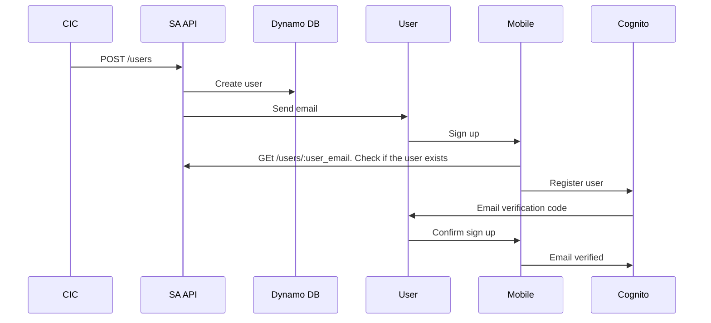
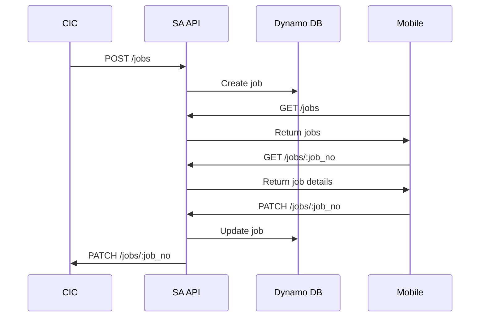

## User Registration

```mermaid
sequenceDiagram
    CIC ->> SA API: POST /users
    SA API ->> Dynamo DB: Create user
    SA API ->> User: Send email
    User ->> Mobile: Sign up
    Mobile ->> SA API: GEt /users/:user_email. Check if the user exists
    Mobile ->> Cognito: Register user
    Cognito ->> User: Email verification code
    User ->> Mobile: Confirm sign up
    Mobile ->> Cognito: Email verified
```

## Job

```mermaid
sequenceDiagram
    CIC ->> SA API: POST /jobs
    SA API ->> Dynamo DB: Create job
    Mobile ->> SA API: GET /jobs
    SA API ->> Mobile: Return jobs
    Mobile ->> SA API: GET /jobs/:job_no
    SA API ->> Mobile: Return job details
    Mobile ->> SA API: PATCH /jobs/:job_no
    SA API ->> Dynamo DB: Update job
    SA API ->> CIC: PATCH /jobs/:job_no

```
